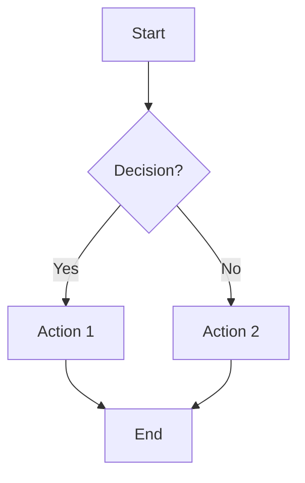

##### 한글 안되고, 띄어쓰기 허용 안되고! "#" 붙이면 주석으로 처리됨.
#주석

```mermaid
graph TD;
    A-->B;
    A-->C;
    B-->D;
    C-->D;
```

```mermaid
flowchart TD;
A[Start] --> B{Decision?}
B -->|Yes| C[Action 1]
B -->|No| D[Action 2]
C --> E[End]
D --> E[End]
```

